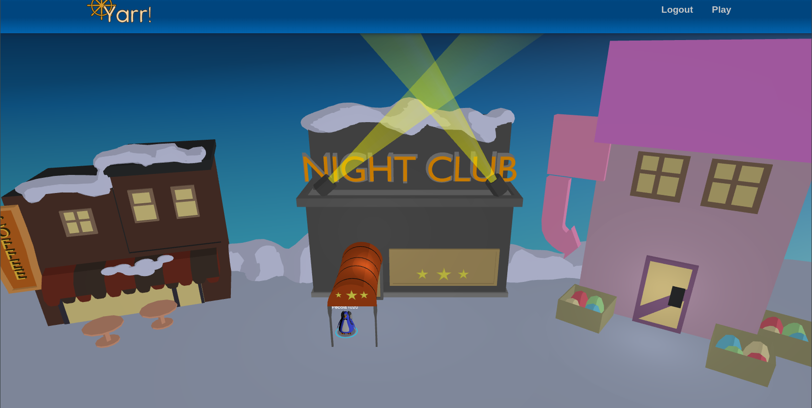
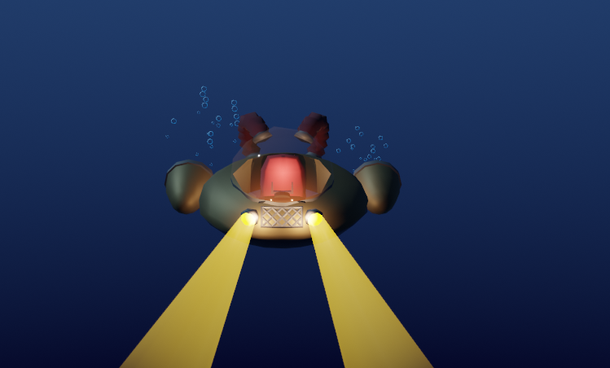

# yarr

## Implemented
- `/` - home, character selector
- `/play` - main gameplay here
- Characters w/ equipped items and floating name
- Profile cards
  - basic render of player w/ items attached
- Clickable callbacks (raycasting)
- Room nav
  - click-to-walk
  - leave/join updates for all players

### Rooms
- Coffee Shop
- Town model (imcomplete)

### GLTF userData (blender custom props):
 - `obj.userData["spawn-from"]` - DbRoom.label
    - obj is spawn position if previous room.label is this value
 - `mesh.userData["goto-room"]` - DbRoom.label
    - mesh is clickable, joins room with this value
 - `material.userData.emission` - float
    - emissiveIntensity of material, when included, emission property of material defaults to white instead of black
 - `mesh.userData.invis` - "true"|"false"
    - when true sets mesh.visible = false
 - `material.userData.toon` - "true"|"false"
    - when set to "false" skips toon material conversion

- Rooms, Items, Assets fully from database uploads, no code required to create new ones

## running
- `npm install`: Installs dependencies

- `npm run dev`: Run a development, HMR web server

- `npm run build`: Production-ready client build

- `npm run db` : uses `pocketbase` as a top level command, you'll want to add it to your path, or run it differently - the 'backend' as it were
Pocketbase is configured in package.json to host the /build directory, which is generated by `npm run build`

## database
pocketbase is used to:
- serve the web client
- serve game assets for rooms and items
- do realtime client updates via pub/sub

The schema can be loaded from pb_schema.json

- users
  - name - display name for account
  - characters - multiple characters per player
    - inventory - items the player owns
    - equipped - items the player has equipped (subset of inventory)
    - x,y,z - position
    - rx,ry,rz - euler rotation
    - name - name of the character
    - room - set this to handle all room updates
- items
  - definition - item_defs entry
  - owner - who owns this item
  - count
- item_defs
  - wearable - boolean
  - wearable_bone_name - string
    - obj.name attach point
  - asset - DbAsset
  - label - string
  - description - string
- rooms
  - model_placements - DbModelPlacements
  - occupants - DbCharacters[]
  - label - string
  - description - string
- model_placements
  - asset - what model to show
  - placements - JSON array of {x,y,z}
  
