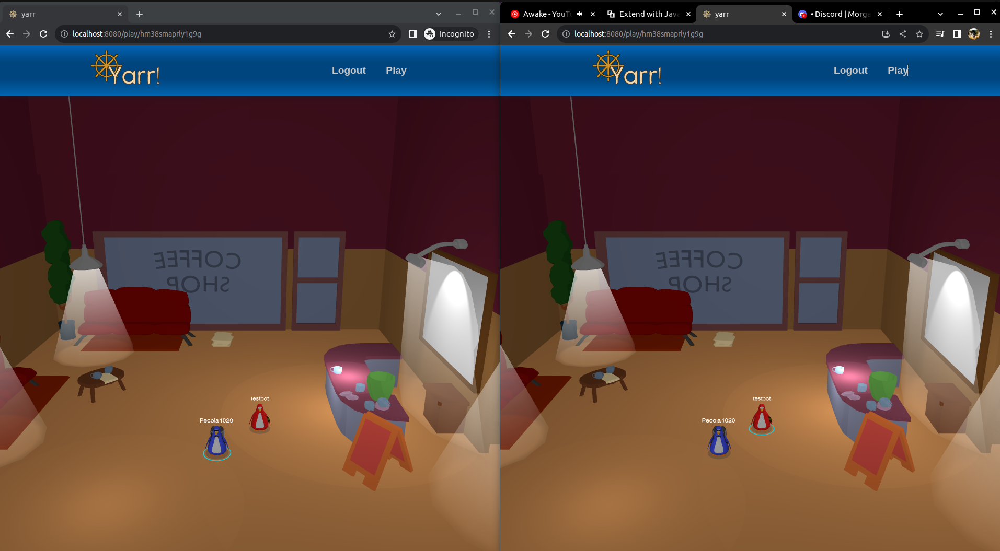

# yarr

## Implemented so far
- `/` - home, also character chooser
- `/play` - in-game
- Characters appear in-game w/ equipped items and floating name
- Profile cards show character w/ equipped items

- Coffee Shop model
- Town model (imcomplete)
- Character model
- Jetpack model

- GLTF userData props:
  - `material.userData.emission` - float that maps to emissiveIntensity of material, when included, emission property of material defaults to white instead of black
  - `mesh.userData.invis` - "true" or "false" strings, when true sets mesh.visible = false
  - `material.userData.toon` - when set to "false" skips toon material conversion
- `room.model_placements` handles multiple placements of the asset model used without duping geometry data

- Rooms, Items, Assets fully from database uploads, no code required to create new ones

## running
- `npm install`: Installs dependencies

- `npm run dev`: Run a development, HMR web server

- `npm run build`: Production-ready client build

- `npm run db` : uses `pocketbase` as a top level command, you'll want to add it to your path, or run it differently - the 'backend' as it were
Pocketbase is configured in package.json to host the /build directory, which is generated by `npm run build`

## database
pocketbase is used to:
- serve the web client
- serve game assets for rooms and items
- do realtime client updates via pub/sub

The schema can be loaded from pb_schema.json

- users
  - name - display name for account
  - characters - multiple characters per player
    - inventory - items the player owns
    - equipped - items the player has equipped (subset of inventory)
    - x,y,z position
    - name - name of the character
- items
  - definition - item_defs entry
  - owner - who owns this item
  - count
- item_defs
  - wearable - item can be worn
  - wearable_bone_name - what to attach to
  - asset - asset entry
  - label
  - description
- rooms
  - model_placements
  - occupants - list of characters
  - label
  - description
- model_placements
  - asset - what model to show
  - placements - JSON array of {x,y,z}
  
