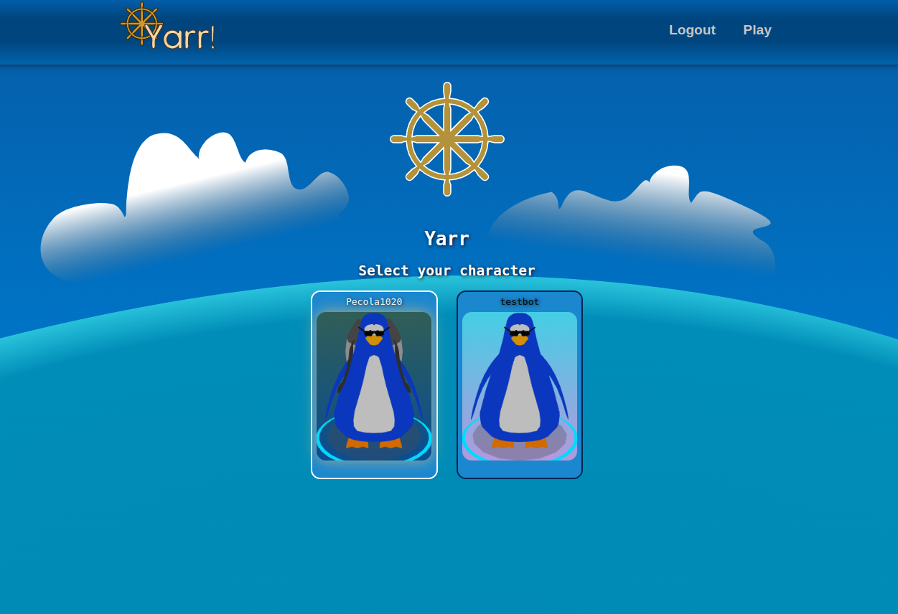

# yarr

## running
- `npm install`: Installs dependencies

- `npm run dev`: Run a development, HMR server

- `npm run build`: Production-ready build

## database
pocketbase is used to:
- serve the web client
- serve game assets for rooms and items
- do realtime client updates via pub/sub

The schema can be loaded from pb_schema.json

- users
  - name - display name for account
  - characters - multiple characters per player
    - inventory - items the player owns
    - equipped - items the player has equipped (subset of inventory)
    - x,y,z position
    - name - name of the character
- items
  - definition - item_defs entry
  - owner - who owns this item
  - count
- item_defs
  - wearable - item can be worn
  - wearable_bone_name - what to attach to
  - asset - asset entry
  - label
  - description
- rooms
  - instanced_models
  - occupants - list of characters
  - label
  - description
- instanced_models
  - asset - what model to show
  - placements - JSON array of {x,y,z}
  
